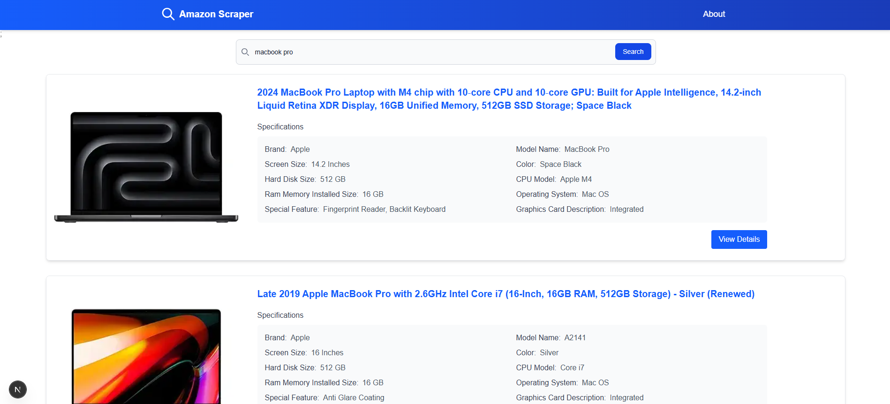

# Amazon Scraper

A web application built with Next.js and Tailwind CSS that extracts and displays product information from Amazon in a clean, organized format.



## Tech Stack

- **Frontend**: Next.js (React), TypeScript
- **Styling**: Tailwind CSS
- **Data Fetching**: Custom scraping logic

### Installation

1. Clone the repository
   ```bash
   git clone git@github.com:nikpithadiya/amazon-scraper.git
   cd amazon-scraper
   ```

2. Install dependencies
   ```bash
   npm install
   # or
   yarn install
   ```

3. Run the development server
   ```bash
   npm run dev
   # or
   yarn dev
   ```

4. Open [http://localhost:3000](http://localhost:3000) in your browser to see the application

## Legal Disclaimer

This web application is designed for educational purpose only. Please ensure you adhere to Amazon's Terms of Service when using information obtained from this application.
